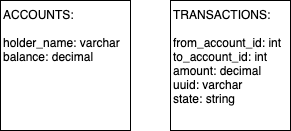
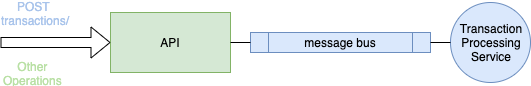

### Money Transfer

All explicit requirements are met, except this one: 'The datastore should run in-memory for the sake of simplicity for this test.'. I've chosen sqlite3 as DB and tehre's not so much difference between in-memory/persistent mode. In-memory mode would only increase the complexity of the code.

## Design

Lets assume that we have only one currency and one user can have only one account.
I decided to keep things simple and created 2 tables:



Unfortunately sqlite doesn't have enum (for state) and uuid types, but it's not a big deal in our case.
There are many ways to store currencies in a database and using decimal type is probably not good idea (much better to keep it as cents using bigint). But in our case it works perfectly.

For the app itself I've chosen simple but powerful solution.



Since account-related operations are trivial and happen not really often - they are processed on the main backend. I think 80% (or even 90%) of load on average something-transfer system goes with transaction processing. And it's really important do not block IO and give the response ASAP. That's why I think it's a great idea to push transaction data into some message broker and give an immediate response. And there will be a microservice to process transactions asynchronously of course 🙃.

Hot damn! Isn't it?

## Tech Stack

To keep things simple I decided to use Sidekiq + redis to emulate microservice and message broker functionality. We just push transaction data to redis and process it in background. I also use sqlite3 as db because it's fast and simple.

## REST API
Available endpoints:
```
GET    /transactions?page=
GET    /transactions/:id
POST   /transactions

GET    /accouns?page=
GET    /accounts/:id
POST   /accounts
```

I like keeping API structure as flat as possible. I think it's better to pass an additional param (like ?user_id=1) to the API than have nested/hell/of/names. Actually it's not applicable to my solution so it's just FYI hahahh. I also keep json data model as consistent as possible.

For index actions: 
```
{
  data: [],
  page: 1
  total_pages: 1
}
```

For show it's just a json'ed resource.

For errors it's `{error: {field: [errors]}}`.

HTTP codes used:
```
GET 200/404
POST 201/202 (only when create transaction)/422
```

I'd love to provide normal swagger documentation but I'm pretty sure you don't really need it hahah.

## Testing

The coverage is 100%.
I usually write tests using rspec but for this task I decided to use default minitest. Now or never!
A few words about testing: I personally prefer functional and integration testing over any other approach. I try to cover as many interacting components as possible instead of testing every small piece of code (but sometimes you have to do that of course if there are some SUPER IMPORTANT calculations involved).

## What's missed?
Logging and monitoring stuff.

##Setup
- clone the repo
- install sqlite3, redis
- `bundle`
- `rails db:setup`
- `rails test`
- launch redis: `redis-server /usr/local/etc/redis.conf --save "" --appendonly no`
- launch sidekiq: `sidekiq work`
- launch puma: `puma -t 64:128 -w 3 --preload`
- execute load-testing script: `ruby bench.rb`

## Benchmark bench.rb
It's probably better to run proper load testing using jmeter or something similar. Adding more threads/processes make my macbook restart (it's quite old haha). But you can play with numbers I'm pretty sure my solution is very scalable ;)
I find these puma options optimal for my workstation: `-t 64:128 -w3`. It takes only 308596 bytes RAM (measured with https://gist.github.com/netj/526585) and `4.47s user 3.02s system 75% cpu 9.871 total` time to pass the benchmark.

